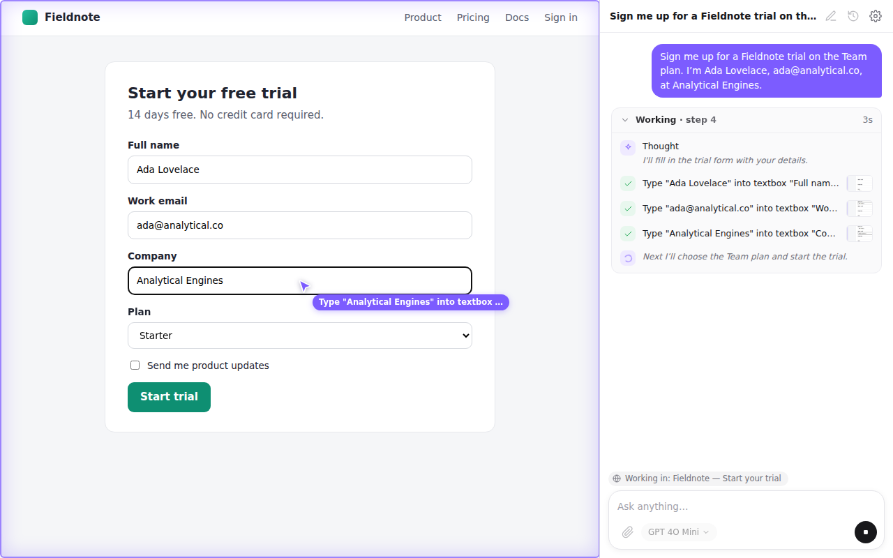
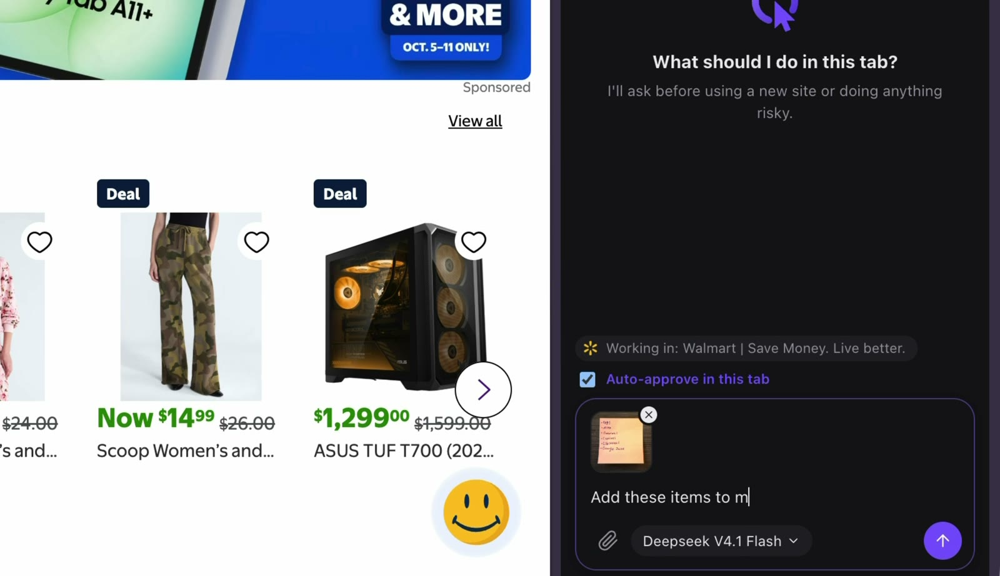

<p align="center">
  
</p>

<h1 align="center">Errand</h1>

<p align="center">
  An AI agent that browses for you, in your browser's side panel.<br>
  Bring any OpenAI-compatible model: OpenAI, OpenRouter, Ollama, LM Studio and more.
</p>

<p align="center">
  <!-- Replace with the Chrome Web Store link once the listing is approved. -->
  <a href="https://github.com/Dread63/errand/releases/latest">Download</a> ·
  <a href="#quick-start">Quick start</a> ·
  <a href="PRIVACY.md">Privacy</a>
</p>

<p align="center">
  
</p>

<p align="center">
  <a href="https://youtu.be/pM8CUjJwu2s"></a>
</p>

## What it does

Tell Errand what you need ("fill in this form from my notes", "compare these two products", "copy this table into the spreadsheet") and it does it in your real browser. It reads the page, moves a visible cursor, clicks and types, and reports back. You watch every step.

- **Any model.** Works with any OpenAI-compatible `/v1/chat/completions` API, hosted or on your own machine. No Errand account, no subscription.
- **You stay in control.** It asks before using a new site and before risky actions (purchases, submissions, deletions, passwords, downloads), works only in its own **Errand** tab group, and **Stop** ends a task instantly.
- **See what it's doing.** A live cursor and highlights on the page, and a step-by-step activity log in the panel.
- **Attachments.** Give it images, PDFs or text files to work from.
- **Private.** No servers, no analytics. Everything stays on your device except what you send to your own model provider. See [PRIVACY.md](PRIVACY.md).

## Install

**From the Chrome Web Store** (Chrome, Brave, Edge, Opera, Vivaldi, Arc): coming soon.

**From a release zip** (any Chromium browser):

1. Download `errand-<version>-chrome.zip` from the [latest release](https://github.com/Dread63/errand/releases/latest) and unzip it.
2. Open `chrome://extensions` (or `edge://extensions`, `brave://extensions`…) and turn on **Developer mode**.
3. Click **Load unpacked** and choose the unzipped folder.
4. Pin Errand and click its icon to open the side panel.

Firefox isn't supported: it lacks the `debugger` API Errand uses to send real clicks.

## Quick start

1. Click the Errand icon. The side panel says **Connect a model to get started**. Click **Open Settings**.
2. Click **Add provider** and pick a preset.
3. Paste your API key if the provider needs one, click **Test connection**, pick a model, and click **Save**.
4. Go to any page, type a task in the side panel and press **Send**.

### Provider notes

| Provider | Base URL | Notes |
|---|---|---|
| **OpenAI** | `https://api.openai.com/v1` | Use a model with tool calling, e.g. a GPT-4o or newer family model. |
| **OpenRouter** | `https://openrouter.ai/api/v1` | One key for hundreds of models. Turn on images for models that accept them. |
| **Ollama** (local) | `http://localhost:11434/v1` | Ollama rejects requests from extensions by default. Start it with `OLLAMA_ORIGINS=chrome-extension://* ollama serve`. Pick a model with tool calling (e.g. Qwen). |
| **LM Studio** (local) | `http://localhost:1234/v1` | Start the server and turn on **CORS** in its settings. |
| **OpenCode Go** | `https://opencode.ai/zen/go/v1` | Set **Reasoning effort: Low** for fast steps; GLM models think for minutes at the model default. |
| **Anything else** | your `/v1` URL | Any server that speaks the OpenAI chat-completions API with tool calls (vLLM, llama.cpp server, LiteLLM, …). |

**Self-hosted model on another machine** (e.g. a desktop with a GPU, reached over Tailscale or your LAN): make the server listen on all interfaces, not only `127.0.0.1`, and use `http://<machine-name-or-ip>:<port>/v1` as the base URL.

**Settings worth knowing**
- **Context mode**: *Compact* for small local models (shorter prompts and page snapshots), *Full* for large-context hosted models.
- **Supports images**: turn on only if the model accepts image inputs. Errand then also sends screenshots.
- **Reasoning effort**: lower is faster on reasoning models.

## How it works

- Errand moves the tab you start from into a purple **Errand** tab group, and works only in tabs in that group (including ones it opens).
- It asks **before touching a new site** (Allow once / Always allow / Deny) and **before risky actions**. Edit the risky words in Settings → General.
- While a task runs, Chrome shows a **"started debugging this browser"** bar. That's how Errand sends real mouse and keyboard input. Closing the bar pauses the task.
- Past chats are under **History**, stored only on this device. Screenshots aren't saved.

### Permissions

| Permission | Why |
|---|---|
| `debugger` | Real clicks, typing and screenshots via the Chrome DevTools Protocol, only on Errand's tabs during a task. |
| All sites + content script | Read page structure and show the cursor on whatever site your task needs (with your approval), and reach your model endpoint at any URL. |
| `scripting` | Load Errand's page script into tabs that were open before it was installed. |
| `tabs`, `tabGroups` | Follow and group the tabs the agent works in. |
| `sidePanel` | The chat UI. |
| `storage`, `unlimitedStorage` | Settings and local chat history, including attachments. |

## Develop

```bash
npm install
npm run dev            # WXT dev mode with reload
npm test               # unit tests (Vitest)
npm run compile        # type-check
npm run test:e2e       # builds, then runs Playwright against the real extension
npm run test:live:e2e  # real-model tasks; needs OPEN_CODE_GO_API_KEY in .env.local
npm run build          # production build in .output/chrome-mv3
npm run zip            # .output/errand-<version>-chrome.zip
npm run icons          # regenerate the logo and icons from src/lib/ui/logo.ts
npm run store-assets   # regenerate the store screenshots in docs/store
```

`test:live:e2e` runs each task with reasoning effort `default` and `low` (override with `LIVE_EFFORTS=low`, `LIVE_MODEL=…`) and prints a pass/fail and timing table. **Log step timings** in Settings writes per-phase timings to the service worker console.

Design docs live in [`docs/superpowers/specs`](docs/superpowers/specs).

## Releasing

1. Bump `version` in `package.json` and add an entry to [CHANGELOG.md](CHANGELOG.md).
2. Commit and push, then tag and push the tag: `git tag vX.Y.Z && git push origin vX.Y.Z`.
3. The **Release** workflow tests the build, checks the tag matches `package.json`, and attaches `errand-X.Y.Z-chrome.zip` to a GitHub release.
4. Upload that zip in the [Chrome Web Store dashboard](https://chrome.google.com/webstore/devconsole). Listing text and permission justifications are in [`docs/store/listing.md`](docs/store/listing.md).

## License

[AGPL-3.0](LICENSE). You can use, study, change and share Errand. If you distribute a modified version, or run one as a service for others, you must release your changes under the same license.
